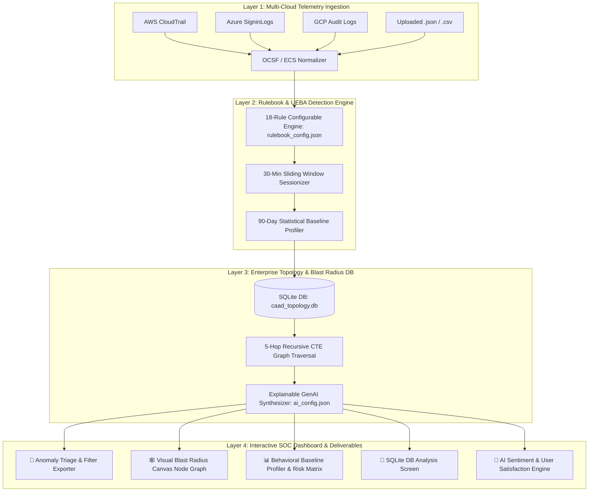

# Executive Presentation: Cloud Access Anomaly Detection & UEBA SIEM Platform

## 📌 Presentation Overview
- **Title**: Enterprise Cloud Access Anomaly Detection & UEBA SIEM Platform
- **Format**: 5-Slide Executive Pitch Deck & Technical Overview
- **Target Audience**: SOC Leadership, Chief Information Security Officers (CISOs), & Security Engineering Leads

---

# Slide 1: Problem Statement

### ❌ The Challenges in Modern Cloud Security Operations (SOC)

1. **Massive Cloud Log Volume & Alert Fatigue**:
   - Security Operations Centers (SOCs) are overwhelmed by millions of daily telemetry events across AWS CloudTrail, Azure Entra ID, GCP Audit, and Okta.
   - High false-positive rates cause critical threats to be lost in noise.

2. **Identity Drift & Compromised Credential Misuse**:
   - 80%+ of cloud breaches exploit valid credentials (MFA push fatigue, impossible travel velocity, dormant admin account reactivations).
   - Standard static SIEM rules fail to establish individual 90-day behavioral baselines ($\mu, \sigma, +3\sigma$).

3. **Blind Spots in Downstream Blast Radius & Entitlements**:
   - Analysts cannot immediately visualize how a compromised identity propagates through complex IAM roles, Key Vault secrets, S3 buckets, and production databases.

4. **Opaque & Fragmented Log Inspection**:
   - Raw JSON logs require manual correlation across MITRE ATT&CK tactics, D3FEND countermeasures, and SOC remediation CLI commands.

---

# Slide 2: Proposed Solution

### 🛡️ Local-First Cloud Access Anomaly Detection & UEBA Platform

1. **Unified Multi-Cloud Schema Normalization (OCSF 1.1 / ECS / CIM / KQL)**:
   - Ingests raw telemetry from AWS, Azure, GCP, and Okta, automatically standardizing fields into a single normalized model.

2. **90-Day Behavioral Baseline & Sliding Window Sessionization**:
   - Calculates statistical daily mean ($\mu$), standard deviation ($\sigma$), and 30-minute session velocity spikes ($+3\sigma$) to flag true anomalies.

3. **SQLite 5-Hop Graph CTE & Canvas Blast Radius Visualizer**:
   - Runs a 5-hop recursive CTE graph traversal on `caad_topology.db` (1,050 entities, 2,593 edges) to compute real-time Blast Radius Scores:
   $$\text{Blast Radius Score} = \sum_{i \in \text{Reachable Assets}} \left( \text{Criticality}_i \times \text{Sensitivity}_i \times \frac{1}{\text{Hop Depth}_i} \right)$$

4. **Explainable AI Root-Cause Synthesizer & Sentiment Engine**:
   - Generates plain English incident summaries, maps MITRE ATT&CK execution paths ($T1078.004, T1621, T1098.001$), provides D3FEND countermeasures, and captures analyst feedback with AI sentiment scoring.

---

# Slide 3: Architectural Diagram & System Flow

### 🏗️ End-to-End Ingestion, Analytics & Presentation Architecture

---

# Slide 4: Key Existing Features

### ✨ Production-Ready Capabilities Delivered in Current Version

1. **Configurable Detection Rulebook (`rulebook_config.json`)**:
   - 18-rule catalog comprising 5 False Positive operational baseline rules (`FP-RULE-001` to `005`) and 13 Threat Anomaly rules (`THREAT-RULE-001` to `013`).

2. **Interactive Visual Blast Radius Node Graph Engine**:
   - HTML5 Canvas visualizer rendering entry nodes, radial 5-hop connections, edge labels, and hover inspection tooltips.

3. **Behavioral Baseline Profiler & Risk vs. Blast Radius Matrix**:
   - 2D scatter plot mapping ML Risk Score vs. Blast Radius Score across 4 threat quadrants (*Critical Threat Zone, High Entitlement Risk, Isolated Anomaly, Operational Baseline*).

4. **Analyst Text Feedback & AI Sentiment Analysis Engine**:
   - Captures analyst natural-language comments on alerts, computes AI sentiment scores ($-1.0$ to $+1.0$), and tracks real-time User Satisfaction Index ($\%$) in top KPI banner.

5. **In-Report Interactive Filter Exporter & SIEM Download Center**:
   - Exports tabulated telemetry reports with in-report filter controls (*Event ID, Cloud, User, Country, Scenario, Severity*) and full AI summaries, MITRE paths, and remediation CLIs. Includes 4-platform log format generators (OCSF, Sentinel KQL, Splunk CIM, Elastic ECS).

6. **SOC Theme Switcher (Dark & Light Mode)**:
   - Dynamic dark SOC slate (`#06090e`) and light slate (`#f1f5f9`) themes.

---

# Slide 5: New Enhancements Planned

### 🚀 Strategic Roadmap & Future Development Phase

1. **Real-Time Streaming Backend Webhooks (Kafka / EventBridge)**:
   - Upgrade ingestion from file polling/uploading to live WebSocket/gRPC telemetry streams from AWS EventBridge, Azure Event Hubs, and GCP Pub/Sub.

2. **Automated Headless Chrome PDF Generation Pipeline**:
   - Integrate server-side PDF generation (`Puppeteer`/`Playwright`) to auto-email printable CISO executive reports on scheduled cron timers (`/schedule`).

3. **Local LLM Fine-Tuning on Enterprise Baseline Logs**:
   - Fine-tune lightweight local models (`Ollama` / `Llama-3-8B`) on historical 90-day baseline logs for zero-latency offline incident summarization.

4. **Automated SOAR Playbook Execution via Terraform & Ansible**:
   - Connect 1-Click SOC remediation playbooks directly to cloud APIs (AWS SDK/Boto3, Azure Management SDK) for automated IAM role revocation, KMS key rotation, and IP blocking.

---

## 📌 Summary Table: PPT Slide Deck Structure

| Slide # | Slide Title | Primary Focus & Deliverables |
| :--- | :--- | :--- |
| **Slide 1** | **Problem Statement** | Cloud log overload, alert fatigue, identity drift, lack of blast radius visibility. |
| **Slide 2** | **Proposed Solution** | Local-first UEBA SIEM, OCSF normalization, 5-hop CTE blast radius calculation, GenAI summaries. |
| **Slide 3** | **Architecture Diagram** | 4-layer Mermaid architecture flowchart from ingestion to interactive SOC dashboard. |
| **Slide 4** | **Existing Features** | 18-rule catalog, Canvas node graph, Baseline profiler, Risk vs Blast Matrix, AI sentiment engine, Exporter. |
| **Slide 5** | **Planned Enhancements** | Real-time streaming webhooks, Headless PDF pipeline, Local LLM fine-tuning, Automated SOAR playbooks. |
