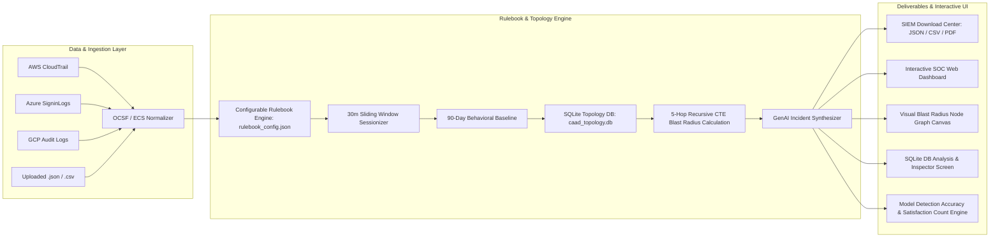

# Master Implementation Plan: Cloud Access Anomaly Detection & UEBA SIEM Platform

## Project Overview
This project delivers an end-to-end **Cloud Access Anomaly Detection and User Behavior Analytics (UEBA)** solution. It addresses the challenge of high-volume cloud access logs, alert fatigue, and lack of context in conventional SIEM tools by combining:
1. **Public Data Sources & Engineering Pipelines**: Standardized ingestion of AWS CloudTrail, Azure/Entra ID, GCP Audit, and Okta logs with OCSF normalization and sessionization.
2. **All 4 SIEM Report Formats**: Downloadable datasets in JSON and CSV for Generic/OCSF, Microsoft Sentinel (KQL), Splunk (CIM/RBA), and Elastic/Wazuh (ECS).
3. **Multi-Perspective Strategic Enhancements**:
   - **Explainable AI Root-Cause Narratives & Easy English Summaries**: Human-readable plain English incident summaries with confidence metrics.
   - **Identity Threat Detection & Response (ITDR)**: Dormant privilege drift and 5-hop recursive CTE blast-radius impact analysis.
   - **MITRE ATT&CK Cloud Matrix Alignment**: TTP chaining across Initial Access, Persistence, Privilege Escalation, and Exfiltration.
   - **1-Click SOC Remediation Playbooks**: Automated CLI/PowerShell commands to isolate accounts and revoke session tokens.
4. **Universal SIEM File Ingestion & Drag-and-Drop Parser**: Automatic normalization of uploaded `.json` and `.csv` SIEM log exports.
5. **Configurable Detection Rulebook (`rulebook_config.json`)**: Configurable detection rules and False Positive auto-classification engine for operational baselines.
6. **1,000+ System Enterprise Topology & SQLite Database (`caad_topology.db`)**: Embedded SQLite database storing 1,050 entities, 2,593 relationship edges, and 789 IAM privileges.
7. **SQLite DB Telemetry Analysis Screen**: Dedicated interactive DB inspector screen to query SQLite tables (`entities`, `relationships`, `identity_privileges`, `ingested_logs`).
8. **Interactive Visual Blast Radius Node Graph**: Real-time canvas node-link visualizer rendering 5-hop asset connections, criticality weights, and edge relationships.

---

## User Review Required

> [!IMPORTANT]
> **Data Format Standard**: All 4 SIEM platforms (Generic OCSF, Microsoft Sentinel, Splunk CIM, Elastic/Wazuh) are pre-populated with realistic cloud anomaly scenarios (Impossible Travel, MFA Fatigue, Dormant IAM Backdoors, Mass S3 Exfiltration, and Audit Log Deletion) and available in both `.json` and `.csv` formats.

> [!NOTE]
> The dashboard operates locally with zero external backend dependencies using Vanilla HTML5/CSS3/ES6, Canvas-based Node Graph Visualizer, and client-side Chart.js visualizations.

---

## Implementation Roadmap & Architecture

---

## Proposed Changes & File Structure

### 1. Data Sources & Schema Engineering Catalog
- [`data_sources_guide.md`](file:///c:/antiProjects/CAAD/data_sources_guide.md)
  - Detailed directory of public benchmarks (flaws.cloud, Splunk BOTS v1–v3, CMU CERT r4.2/r6.2, LANL Cyber1, Microsoft Defender datasets, Stratus Red Team).
  - Normalization specifications for OCSF 1.1, Elastic Common Schema (ECS), Splunk CIM 5.0, and Azure Log Analytics KQL tables.
  - Sessionization algorithm, feature vector definitions, and PII anonymization / tokenization rules.
  - **SQLite Database Specifications (`caad_topology.db`)**: `entities` (1,050 nodes), `relationships` (2,593 edges), `identity_privileges` (789 permissions), and 5-hop recursive CTE graph traversal query.

---

### 2. Configurable Log Analysis Rulebook
- [`rulebook_config.json`](file:///c:/antiProjects/CAAD/rulebook_config.json)
  - Configurable False Positive classification rules (e.g. `FP-RULE-001` matching non-malicious operational baseline events).
  - Threat detection rules (`THREAT-RULE-001` through `003`) mapping velocity thresholds, MFA prompt limits, and dormant account reactivation days to MITRE TTPs.

---

### 3. Multi-Platform SIEM Sample Report Datasets
Located in [`data/`](file:///c:/antiProjects/CAAD/data):

- **Platform 1: Generic / Multi-Cloud OCSF UEBA**
  - [`sample_generic_ueba_siem.json`](file:///c:/antiProjects/CAAD/data/sample_generic_ueba_siem.json)
  - [`sample_generic_ueba_siem.csv`](file:///c:/antiProjects/CAAD/data/sample_generic_ueba_siem.csv)

- **Platform 2: Microsoft Sentinel / Azure Monitor**
  - [`sample_microsoft_sentinel.json`](file:///c:/antiProjects/CAAD/data/sample_microsoft_sentinel.json)
  - [`sample_microsoft_sentinel.csv`](file:///c:/antiProjects/CAAD/data/sample_microsoft_sentinel.csv)

- **Platform 3: Splunk Enterprise & Cloud**
  - [`sample_splunk_cim.json`](file:///c:/antiProjects/CAAD/data/sample_splunk_cim.json)
  - [`sample_splunk_cim.csv`](file:///c:/antiProjects/CAAD/data/sample_splunk_cim.csv)

- **Platform 4: Elastic Security & Wazuh SIEM**
  - [`sample_elastic_wazuh.json`](file:///c:/antiProjects/CAAD/data/sample_elastic_wazuh.json)
  - [`sample_elastic_wazuh.csv`](file:///c:/antiProjects/CAAD/data/sample_elastic_wazuh.csv)

- **Platform 5: Mock False Positive Ingestion Benchmarks**
  - [`mock_sentinel_fp_50.json`](file:///c:/antiProjects/CAAD/mock_sentinel_fp_50.json): 50 mock events containing non-malicious operational baseline logs auto-classified as `FALSE POSITIVE`.

---

### 4. Enterprise Topology & SQLite Database
- [`caad_topology.db`](file:///c:/antiProjects/CAAD/caad_topology.db): SQLite DB pre-seeded with 1,050 systems & IAM accounts and 2,593 graph edges.
- [`scratch/build_topology_db.py`](file:///c:/antiProjects/CAAD/scratch/build_topology_db.py): Seed script generating 1,000+ connected topology nodes and edges.
- [`scratch/query_blast_radius.py`](file:///c:/antiProjects/CAAD/scratch/query_blast_radius.py): Python script executing 5-hop CTE recursive graph queries.

---

### 5. Interactive Web Application (Modern SOC Dashboard & Downloader)
- [`index.html`](file:///c:/antiProjects/CAAD/index.html)
  - Top SOC metrics bar (Critical/High alerts, Model Detection Accuracy, Satisfaction Count, ML confidence).
  - Header AI configuration button (`⚙️ AI Config`) and Theme Switcher (`☀️ Light Mode` / `🌙 Dark Mode`).
  - 8-tab structure: Anomaly Triage, Behavioral Baseline Profiler, 1,000+ System Topology & Visual Node Graph, SQLite DB Analysis, SIEM Download Center, SIEM Upload & Ingestion, Attack Simulator, Data Sources Catalog.
  - Modals for AI Log Summarization on Inspect, Easy English MITRE ATT&CK/D3FEND Countermeasures, 1-Click Remediation Playbooks, and AI Engine Configuration.
- [`styles.css`](file:///c:/antiProjects/CAAD/styles.css)
  - Cyber-slate SOC theme (`#06090e`), Light theme overrides (`[data-theme="light"]`), JetBrains Mono & Inter typography, responsive dropzones, `.badge-false-positive` badges, node graph canvas containers, and printable PDF report stylesheet.
- [`app.js`](file:///c:/antiProjects/CAAD/app.js)
  - Universal SIEM file parser for `.json` and `.csv` drag-and-drop uploads.
  - Rulebook False Positive auto-classification engine (`normalizeSiemRecord`).
  - Analyst feedback tracking (`👍 Confirmed` / `👎 False Positive`) and real-time **Model Detection Accuracy** and **Satisfaction Count** calculator.
  - SQLite DB Telemetry Analysis Screen (`renderDbAnalysisScreen`).
  - HTML5 Canvas **Blast Radius Node Graph Visualizer** with color-coded node taxonomy, directed edge lines, hop labels, and node hover inspection.
  - GenAI Incident Summarizer & Easy English MITRE ATT&CK/D3FEND Countermeasures generator.

---

## Verification Plan

### Automated & Structural Checks
1. Validate JSON and CSV file syntax across all platforms in `data/` and `mock_sentinel_fp_50.json`.
2. Confirm SQLite `caad_topology.db` queries execute without errors.

### Manual / Browser Verification
1. Open `http://localhost:8080` in the browser.
2. Drag & drop [`mock_sentinel_fp_50.json`](file:///c:/antiProjects/CAAD/mock_sentinel_fp_50.json) in **`📤 SIEM Upload & Ingestion`** and verify automatic `FALSE POSITIVE` severity records in **`🚨 Anomaly Triage`**.
3. Navigate to **`💾 SQLite DB Analysis`** and test inspecting tables (`ingested_logs`, `entities`, `relationships`, `identity_privileges`, `rulebook`).
4. Navigate to **`🕸️ 1,000+ System Topology`** and verify the interactive **Blast Radius Visual Node Graph**.
5. Click **Inspect** on any user anomaly in **`🚨 Anomaly Triage`** to verify AI Plain English Log Summarization & MITRE D3FEND Countermeasures.
