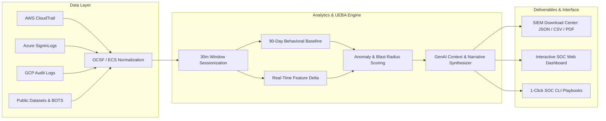

# Master Implementation Plan: Cloud Access Anomaly Detection & UEBA SIEM Platform

## Project Overview
This project delivers an end-to-end **Cloud Access Anomaly Detection and User Behavior Analytics (UEBA)** solution. It addresses the challenge of high-volume cloud access logs, alert fatigue, and lack of context in conventional SIEM tools by combining:
1. **Public Data Sources & Engineering Pipelines**: Standardized ingestion of AWS CloudTrail, Azure/Entra ID, GCP Audit, and Okta logs with OCSF normalization and sessionization.
2. **All 4 SIEM Report Formats**: Downloadable datasets in JSON and CSV for Generic/OCSF, Microsoft Sentinel (KQL), Splunk (CIM/RBA), and Elastic/Wazuh (ECS).
3. **Multi-Perspective Strategic Enhancements**:
   - **Explainable AI Root-Cause Narratives**: Human-readable 3-sentence attack summaries with confidence metrics.
   - **Identity Threat Detection & Response (ITDR)**: Dormant privilege drift and blast-radius impact analysis.
   - **MITRE ATT&CK Cloud Matrix Alignment**: TTP chaining across Initial Access, Persistence, Privilege Escalation, and Exfiltration.
   - **1-Click SOC Remediation Playbooks**: Automated CLI/PowerShell commands to isolate accounts and revoke session tokens.
4. **Interactive SOC Dashboard & Live Anomaly Simulator**: A dark-themed web interface for behavioral baseline comparisons, drill-down inspections, adversarial simulations, and batch report downloads.

---

## User Review Required

> [!IMPORTANT]
> **Data Format Standard**: All 4 SIEM platforms (Generic OCSF, Microsoft Sentinel, Splunk CIM, Elastic/Wazuh) are pre-populated with realistic cloud anomaly scenarios (Impossible Travel, MFA Fatigue, Dormant IAM Backdoors, Mass S3 Exfiltration, and Audit Log Deletion) and available in both `.json` and `.csv` formats.

> [!NOTE]
> The dashboard operates locally with zero external backend dependencies using Vanilla HTML5/CSS3/ES6 and client-side Chart.js visualizations.

---

## Implementation Roadmap & Architecture

---

## Proposed Changes & File Structure

### 1. Data Sources & Schema Engineering Catalog
- [NEW] [`data_sources_guide.md`](file:///C:/Users/GENAISINCBPUSR11/.gemini/antigravity/scratch/siem-analytics-dashboard/data_sources_guide.md)
  - Detailed directory of public benchmarks (flaws.cloud, Splunk BOTS v1–v3, CMU CERT r4.2/r6.2, LANL Cyber1, Microsoft Defender datasets, Stratus Red Team).
  - Normalization specifications for OCSF 1.1, Elastic Common Schema (ECS), Splunk CIM 5.0, and Azure Log Analytics KQL tables.
  - Sessionization algorithm, feature vector definitions, and PII anonymization / tokenization rules.

---

### 2. Multi-Platform SIEM Sample Report Datasets
Located in [`data/`](file:///C:/Users/GENAISINCBPUSR11/.gemini/antigravity/scratch/siem-analytics-dashboard/data):

- **Platform 1: Generic / Multi-Cloud OCSF UEBA**
  - [NEW] [`sample_generic_ueba_siem.json`](file:///C:/Users/GENAISINCBPUSR11/.gemini/antigravity/scratch/siem-analytics-dashboard/data/sample_generic_ueba_siem.json)
  - [NEW] [`sample_generic_ueba_siem.csv`](file:///C:/Users/GENAISINCBPUSR11/.gemini/antigravity/scratch/siem-analytics-dashboard/data/sample_generic_ueba_siem.csv)
  - *Schema*: Normalized OCSF identity events, baseline vs session volume, dormant privilege flags, MITRE ATT&CK TTPs, GenAI explanations, and remediation steps.

- **Platform 2: Microsoft Sentinel / Azure Monitor**
  - [NEW] [`sample_microsoft_sentinel.json`](file:///C:/Users/GENAISINCBPUSR11/.gemini/antigravity/scratch/siem-analytics-dashboard/data/sample_microsoft_sentinel.json)
  - [NEW] [`sample_microsoft_sentinel.csv`](file:///C:/Users/GENAISINCBPUSR11/.gemini/antigravity/scratch/siem-analytics-dashboard/data/sample_microsoft_sentinel.csv)
  - *Schema*: KQL table format matching `SigninLogs`, `AzureActivity`, and `BehaviorAnalytics` with Sentinel Copilot investigation summaries.

- **Platform 3: Splunk Enterprise & Cloud**
  - [NEW] [`sample_splunk_cim.json`](file:///C:/Users/GENAISINCBPUSR11/.gemini/antigravity/scratch/siem-analytics-dashboard/data/sample_splunk_cim.json)
  - [NEW] [`sample_splunk_cim.csv`](file:///C:/Users/GENAISINCBPUSR11/.gemini/antigravity/scratch/siem-analytics-dashboard/data/sample_splunk_cim.csv)
  - *Schema*: Common Information Model (CIM) `Authentication` and `Change_Analysis` data models with Risk-Based Alerting (RBA) risk scores and MLTK anomaly flags.

- **Platform 4: Elastic Security & Wazuh SIEM**
  - [NEW] [`sample_elastic_wazuh.json`](file:///C:/Users/GENAISINCBPUSR11/.gemini/antigravity/scratch/siem-analytics-dashboard/data/sample_elastic_wazuh.json)
  - [NEW] [`sample_elastic_wazuh.csv`](file:///C:/Users/GENAISINCBPUSR11/.gemini/antigravity/scratch/siem-analytics-dashboard/data/sample_elastic_wazuh.csv)
  - *Schema*: ECS v8 event mappings, Wazuh v4.x alert rule levels, and Elastic ML supervised anomaly confidence scores.

---

### 3. Interactive Web Application (Modern SOC Dashboard & Downloader)
- [NEW] [`index.html`](file:///C:/Users/GENAISINCBPUSR11/.gemini/antigravity/scratch/siem-analytics-dashboard/index.html)
  - Top SOC metrics bar (Critical/High alerts, analyzed sessions count, ML confidence).
  - 5-tab structure: Anomaly Triage, Behavioral Baseline Profiler, SIEM Download Center, Attack Simulator, and Data Sources Catalog.
  - Formatted print/PDF summary stylesheet.
- [NEW] [`styles.css`](file:///C:/Users/GENAISINCBPUSR11/.gemini/antigravity/scratch/siem-analytics-dashboard/styles.css)
  - Deep-slate SOC theme (`#080c14`), crisp typography (Inter & JetBrains Mono), high-contrast accessibility, radar/bar chart responsive containers.
- [NEW] [`app.js`](file:///C:/Users/GENAISINCBPUSR11/.gemini/antigravity/scratch/siem-analytics-dashboard/app.js)
  - In-browser Blob file download generator for JSON & CSV across all 4 platforms.
  - Chart.js radar, bar, and scatter charts for baseline deltas and blast radius.
  - Live adversarial attack simulator injecting dynamic anomaly events and real-time AI root-cause narratives.
  - Instant search and severity/cloud provider filters.

---

## Verification Plan

### Automated & Structural Checks
1. Validate JSON and CSV file syntax across all 4 platforms in `data/`.
2. Confirm all fields (MITRE IDs, risk scores, AI narratives, baseline metrics) are correctly populated.

### Manual / Browser Verification
1. Open `http://localhost:8080` in the browser.
2. Verify interactive tab switching across all 5 sections.
3. Test 1-click downloads for Generic, Sentinel, Splunk, and Elastic files in both JSON and CSV.
4. Trigger the Adversarial Attack Simulator (e.g. MFA Fatigue, S3 Ransomware) and verify immediate event injection, stat updates, and AI narrative synthesis.
5. Click "Print / PDF Summary" to verify clean executive reporting layout.
