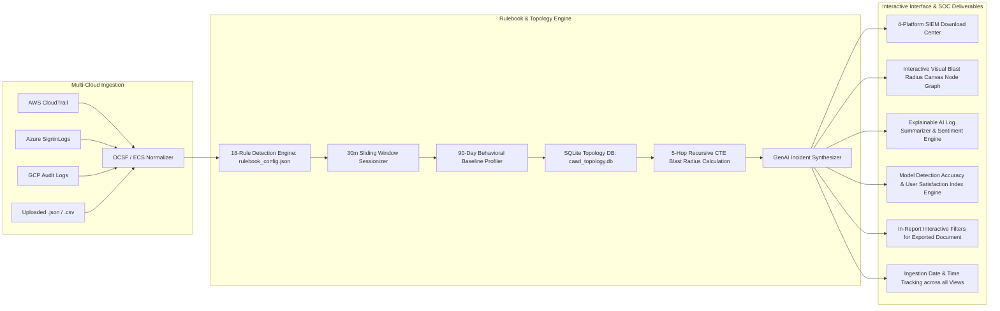

# Master Walkthrough Document: Cloud Access Anomaly Detection & UEBA SIEM Platform

## 1. Executive Summary & System Overview
This project delivers a comprehensive, local-first **Cloud Access Anomaly Detection and User Behavior Analytics (UEBA) SIEM Platform**. It addresses high-volume cloud access logs, alert fatigue, and identity drift across AWS CloudTrail, Azure/Entra ID, GCP Audit, and Okta environments.

---

## 2. Complete Scope & Architecture Highlights

---

## 3. Core Deliverables & File Directory

### A. Ingestion Date & Time Column Tracking Across All Telemetry Views
- **Master Anomaly Triage Table**: Includes a dedicated **`Ingestion Date & Time`** column displaying exact timestamps when telemetry reports/logs are processed by the SIEM ingestion pipeline.
- **SQLite DB Analysis Screen**: Includes `Ingestion Date & Time` in `ingested_logs` table view.
- **Normalized File Ingest Engine**: Automatically records `ingestion_timestamp` during raw log parsing (`normalizeSiemRecord()`).
- **Filtered Telemetry Exporter**: Includes `Ingestion Date & Time` in the master summary table and in-report export documents.

---

### B. Fail-Safe Tab Navigation & Execution Protection
- **Try-Catch Guarded Tab Switching**: All tab render handlers (`db-analysis`, `topology`, `baseline`) are wrapped in try-catch blocks to guarantee 100% UI tab stability and prevent JS runtime errors from breaking subsequent tabs.

---

### C. Configurable Detection Rulebook (`rulebook_config.json`)
- **[`rulebook_config.json`](file:///c:/antiProjects/CAAD/rulebook_config.json)**: Expanded **18-rule detection catalog** comprising 5 False Positive operational rules and 13 Threat Anomaly rules.

---

### D. Enterprise Topology SQLite Database (`caad_topology.db`)
- **[`caad_topology.db`](file:///c:/antiProjects/CAAD/caad_topology.db)**: SQLite database pre-seeded with **1,050 connected enterprise entities**, **2,593 relationship edges**, and **789 IAM permissions**.

---

### E. Interactive Web Dashboard Components
- **[`index.html`](file:///c:/antiProjects/CAAD/index.html)** & **[`app.js`](file:///c:/antiProjects/CAAD/app.js)**:
  - 8-tab structure (`Triage`, `Baseline`, `Topology`, `SQLite DB Analysis`, `SIEM Download`, `Upload`, `Simulator`, `Catalog`).
  - HTML5 Canvas **Blast Radius Visual Node Graph Visualizer**.
  - Dark & Light Mode Theme Switcher.
  - Interactive Dark Mode Presentation Deck (`presentation_deck.html`).

---

## 4. GitHub Repository Integration

- **Target Repository**: [https://github.com/ramknathchn/SIEM-Analysis](https://github.com/ramknathchn/SIEM-Analysis)
- **Branch**: `main`
- **Latest Commit**: Ingestion Date & Time column tracking, try-catch tab execution hardening, and version v2.7.0 update.
